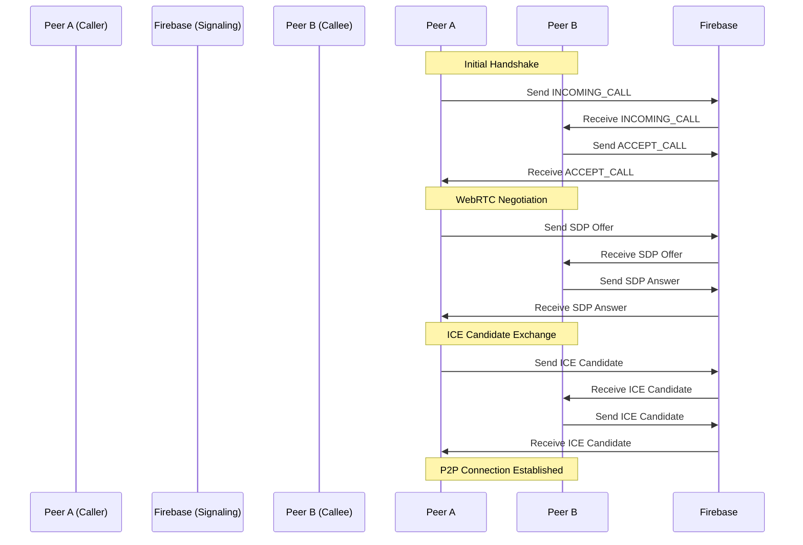
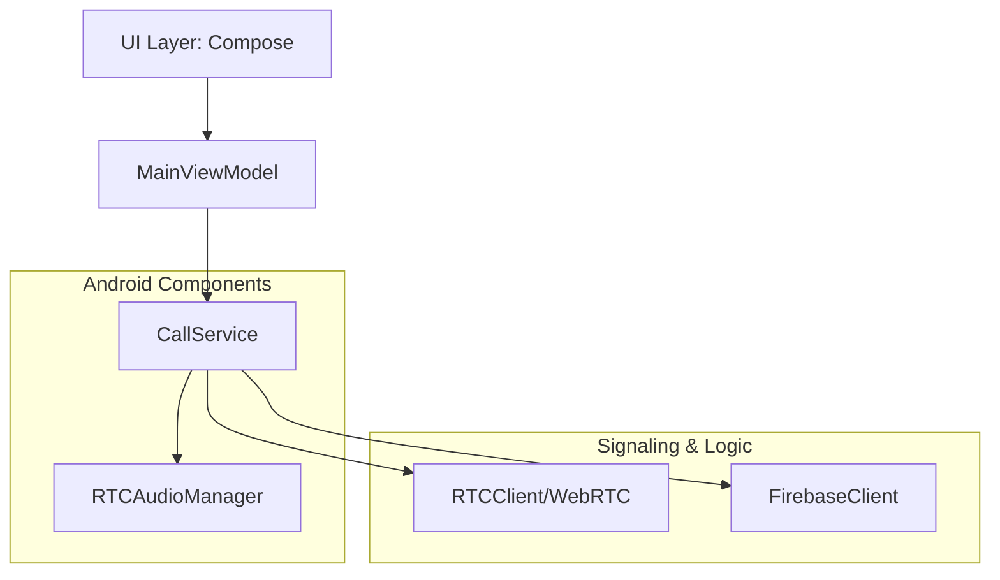

# Production WebRTC Android

**YouTube Channel:** [codewithkael](https://www.youtube.com/@codewithkael)  
**Tutorial Playlist:** [YouTube Playlist Link Placeholder]

---

Production-ready WebRTC implementation for Android, featuring robust signaling, ICE restart logic, and live performance metrics. Built with modern Android development practices.

---

## Key Features

* Reliable peer-to-peer audio/video streaming using WebRTC.
* Real-time signaling implementation using Firebase Realtime Database.
* Intelligent ICE restart logic to handle network switching and temporary disconnections.
* Real-time display of bitrate, packet loss, RTT, Jitter, and FPS.
* Fully built with Jetpack Compose for a smooth and responsive user experience.
* Stable background execution for active calls with notification controls.
* Clean architecture powered by Hilt.

---

## Architecture and Flow

### Signaling Flow
The following diagram illustrates how two peers establish a connection through the Firebase signaling server.



### Project Structure


---

## Tech Stack

1. Language: Kotlin
2. UI Framework: Jetpack Compose
3. WebRTC: org.webrtc:google-webrtc
4. Dependency Injection: Hilt (Dagger)
5. Networking/Database: Firebase Realtime Database
6. Asynchronous Programming: Kotlin Coroutines & Flow
7. JSON Parsing: Gson

---

## Getting Started

### Prerequisites
1. Android Studio Iguana or newer.
2. A Firebase project.

### Setup Instructions

1. Create a project in the Firebase Console.
2. Add an Android App to your Firebase project.
3. Download the google-services.json and place it in the app/ directory.
4. Enable Realtime Database and set your security rules.
5. Open the project in Android Studio and sync Gradle files.
6. Install the app on two different devices.
7. Enter the Participant ID of the other device and hit Call.

---

## License

```text
MIT License

Copyright (c) 2024 CodeWithKael

Permission is hereby granted, free of charge, to any person obtaining a copy
of this software and associated documentation files (the "Software"), to deal
in the Software without restriction, including without limitation the rights
to use, copy, modify, merge, publish, distribute, sublicense, and/or sell
copies of the Software, and to permit persons to whom the Software is
furnished to do so, subject to the following conditions:
...
```

---
Made by [CodeWithKael](https://github.com/codewithkael)
